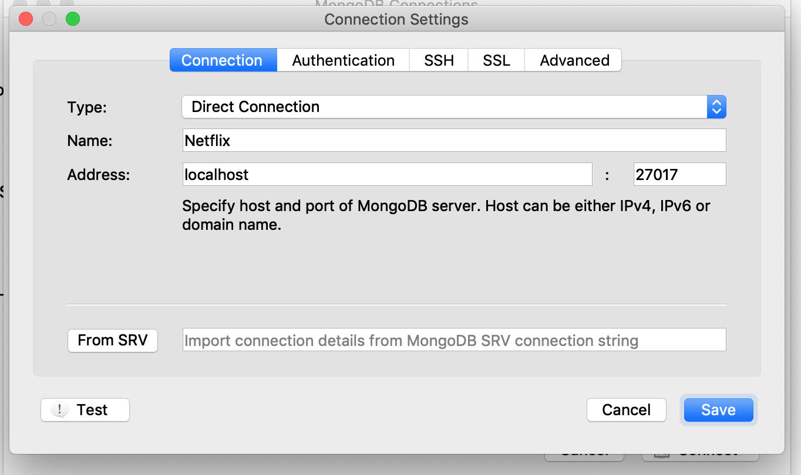
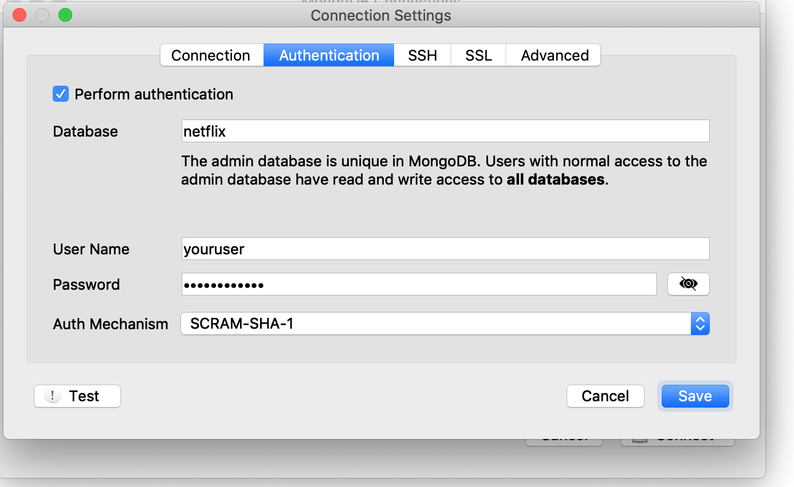

# Project


### Vagrant Provision
##### Start Vagrant
```shell
$ cd YOUR_PATH/react-final-project/
$ vagrant up
```


### API
##### Configure Mongodb 
```shell
$ vagrant ssh
$ sudo /vagrant/config/mongod.sh
```

##### Run Seed 
```shell
$ cd /vagrant/www/api
$ npm install
$ npm run start-seed
```

##### Start API
```shell
$ npm run start-dev
```

### APP
##### Start React App
```shell
$ cd YOUR_PATH/react-final-project/www/app
$ npm install
$ npm start
```

### API
**[Movies]** http://localhost:3001/movies
**[Users]** http://localhost:3001/users
**[Highlights]** http://localhost:3001/highlights


### Configure Robo 3T
**Connection**



**Authentication**



### User password 
| Type    | Name              | Email                              | Password  | Hash  |
| :------ | :---------------- | :--------------------------------- | :-------- | :---- |
| admin   | Leanne Graham     | sincpatriciaere@april.biz          | admin     | MD5   |
| viewer  | Ervin Howell      | shanpatriciana@melissa.tv          | teste123  | MD5   |
| viewer  | Patricia Lebsack  | julipatriciaanne.oconner@kory.org  | teste456  | MD5   |


### Cookie Autentication
```javascript
"name": "app-login",
"time": 2628000000 // 1 mes
```


### References
**[How to setup user authentication in MongoDB 4.0]** 
https://medium.com/@matteocontrini/how-to-setup-auth-in-mongodb-3-0-properly-86b60aeef7e8
**[NODE/MONGODB]** https://medium.com/@uix/building-a-rest-api-using-node-and-mongodb-bf7ac086e8f7

**[ASYNC/AWAIT]** https://codeburst.io/javascript-async-await-with-foreach-b6ba62bbf404
**[ASYNC/AWAIT]** https://medium.com/balta-io/nodejs-async-await-21ca3636252a
**[ASYNC/AWAIT]** https://medium.com/@oieduardorabelo/javascript-armadilhas-do-asyn-await-em-loops-1cdad44db7f0

**[SEED]** https://medium.com/by-vinicius-reis/trabalhando-com-seeds-no-laravel-5-142829ddc32e
**[SEED]** https://www.npmjs.com/package/mongoose-seed-plus

**[REACT]** https://tech.amikelive.com/node-830/reactjs-changing-default-port-3000-in-create-react-app/

**[THROW]** https://developer.mozilla.org/pt-PT/docs/Web/JavaScript/Reference/Extratos_e_declara%C3%A7%C3%B5es/throw

**[Convert JavaScript string in dot notation into an object reference]**
https://stackoverflow.com/questions/6393943/convert-javascript-string-in-dot-notation-into-an-object-reference

**[Axios]**
https://github.com/axios/axios

mongoose-paginate-v2 
https://www.npmjs.com/package/mongoose-paginate-v2

https://medium.com/reactbrasil/https-medium-com-juliocarneiro-menu-dropdown-que-fecha-quando-o-body-e-clicado-1a2bad158d6a


### API Controller 
| Verb      | URI                    | Action  | Route Name     |
| :-------- | :--------------------- | :------ | :------------- |
| GET       | `/movies`              | index   | movies.index   |
| GET       | `/movies/create`       | create  | movies.create  |
| POST      | `/movies`              | store   | movies.store   |
| GET       | `/movies/{photo}`      | show    | movies.show    |
| GET       | `/movies/{photo}/edit` | edit    | movies.edit    |
| PUT/PATCH | `/movies/{photo}`      | update  | movies.update  |
| DELETE    | `/movies/{photo}`      | destroy | movies.destroy |

**[laravel - controllers]**
https://laravel.com/docs/5.8/controllers


#### Destroy Vagrant
```shell
$ vagrant halt
$ vagrant destroy -f
```

```
`${characterName}`: mood,
```